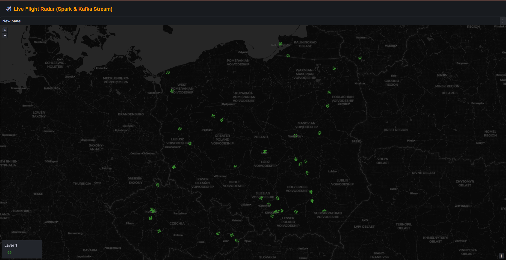

#  Real-Time Flight Tracker Pipeline

### Interaktywna mapa lotów w czasie rzeczywistym

System przetwarzania danych strumieniowych w czasie rzeczywistym, wykorzystujący dane z **OpenSky Network API**. Projekt demonstruje pełny przepływ danych (ETL/ELT) od pozyskania przez API, przez kolejkę Kafka, przetwarzanie w Sparku, aż po wizualizację.

## Architektura i Przepływ Danych (Data Flow)

Projekt opiera się na nowoczesnym stosie technologicznym (Modern Data Stack):

1.  **Pozyskiwanie danych (Airflow):** Apache Airflow zarządza cyklem życia tokenów API i harmonogramem pobierania danych. Tokeny są przechowywane bezpiecznie jako `Airflow Variables`.
2.  **Ingestia (Kafka):** Dane o lotach w formacie JSON trafiają na topic `flights` w klastrze Apache Kafka.
3.  **Przetwarzanie (Spark Streaming):** Aplikacja Spark Structured Streaming subskrybuje topic Kafki, dokonuje transformacji danych (czyszczenie, schematowanie, timestamping) w locie.
4.  **Składowanie (PostgreSQL):** Przetworzone dane są zapisywane do relacyjnej bazy danych Postgres.
5.  **Wizualizacja (Grafana / Leaflet):** Wyniki są prezentowane na interaktywnej mapie (index.html) oraz w dashboardach Grafany.

##  Stack Technologiczny

* **Orkiestracja:** Apache Airflow
* **Strumieniowanie:** Apache Kafka & Zookeeper
* **Przetwarzanie:** Apache Spark (Structured Streaming)
* **Baza danych:** PostgreSQL
* **Wizualizacja:** Grafana, HTML/Leaflet
* **Konteneryzacja:** Docker & Docker Compose

